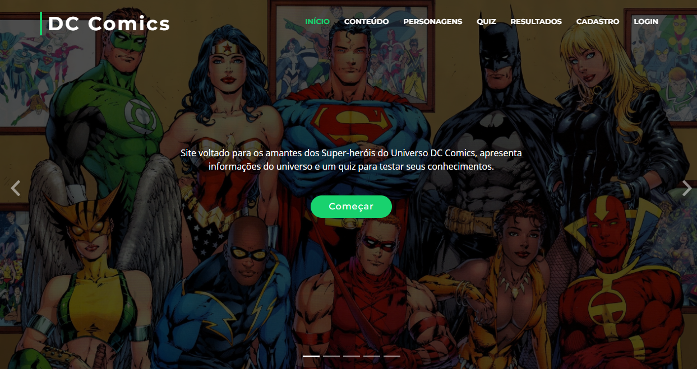

# ProjetoQuizDC
Projeto desenvolvido no Curso Técnico de Desenvolvimento de Sistemas representando um site da DC Comics com autenticação, quiz e os resultados.  

Todo o projeto foi realizado em um site e utiliza as linguagens de programação: HTML 5 + CSS + JS, PHP e para armazenar os dados utilizamos o MySQL.  

